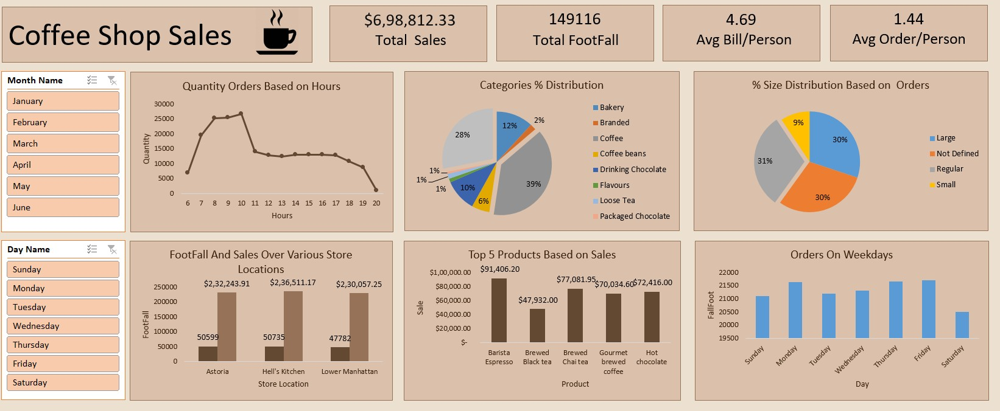

# Coffee Shop Sales Analysis

An Excel-based analysis of a coffee shop's sales data to understand 
what's selling, when customers show up, and which products drive the most revenue.

---

## What this project covers

- Monthly and daily sales trends
- Peak hour and busy day identification
- Top-selling products and categories
- Revenue breakdown by product type
- Interactive Excel dashboard with filters

---

## Tools Used

MS Excel

---

## Dashboard Preview

